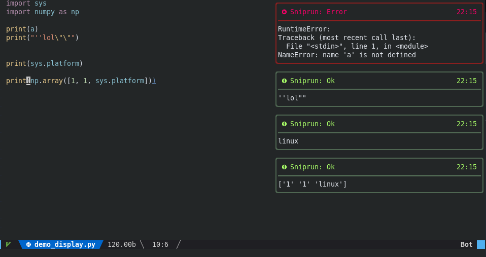

    
     
    
    

# Introduction
Sniprun is a code runner plugin for neovim written in Lua and Rust. It aims to provide stupidly fast partial code testing for interpreted **and compiled** [languages](https://michaelb.github.io/sniprun/sources/README.html#support-levels-and-languages). Sniprun blurs the line between standard save/run workflow, jupyter-like notebook, and REPL/interpreters.

 

TLDR: `Plug 'michaelb/sniprun', {'do': 'bash install.sh'}`, `:SnipRun`, `:'<,'>SnipRun`, `:SnipInfo`

# Installation, configuration, ...

See [installation instructions](https://michaelb.github.io/sniprun/sources/README.html#installation), [configuration tips](https://michaelb.github.io/sniprun/sources/README.html#configuration), [usage explanations](https://michaelb.github.io/sniprun/sources/README.html#usage) and much more useful information on the [wiki](https://michaelb.github.io/sniprun/).

## Demos

##### Send to Sniprun snippets of any language.
A very simple example (in C), play the .gif and look in the command area:

##### The result can be returned in multiple (even at the same time) ways:

[Classic](ressources/display_classic.md)|  [Virtual Text](ressources/display_virtualtext.md)
:------------------------------------------:|:------------------:
   | 
[**Temporary Floating Window**](ressources/display_floating_window.md)  |  [**Terminal**](ressources/display_terminal.md)
 | 
[**Notification**](ressources/display_notify.md) | [**API**](API.md)
 | 

##### REPL-like behavior is available for some languages

Python, Julia, Lua, JavaScript & Typescript (via deno), Clojure, R, Mathematica, Sage, coming soon for many other interpreted (and compiled languages).
With [REPL-like behavior](https://michaelb.github.io/sniprun/sources/README.html#repl-like-behavior), you can run code dependent on previously executed code, just like in a REPL, from within your favorite editor.

## Features

**Sniprun is** a way to quickly run small snippets of code, on the fly, and iterate very quickly and conveniently. To learn a language, to quickly experiment with new features (not yet embedded in classes or a whole project etc...), or to develop simple code pipelines (like a machine learning exercise) that fit in a unique file, sniprun is probably _the_ best plugin out there.

As a matter of proof, Sniprun :

 - supports [all these languages (compiled & interpreted)](https://michaelb.github.io/sniprun/sources/README.html#support-levels-and-languages)
 - can create and connect to REPLs in order to present an interactive and playful interface
 - can run things like GUI plots, networks requests or even Ansible playbooks
 - doesn't require even one line of configuration by default (but can be customized up to the tiniest things)
 - can run code from a part of a file which isn't complete / contains errors
 - can automatically fetch (in some languages) the `imports` necessary for your code snippet
 - can run [live](https://michaelb.github.io/sniprun/sources/README.html#live-mode) (at every keystroke)
 - lends itself to easy [mappings](https://michaelb.github.io/sniprun/sources/README.html#mappings-recommandations) and Vim motions
 - has an API (for running code, and displaying results)
 - has many result display modes that can be enabled at the same time, and for different output status if wanted
 - supports literate programming in Markdown and Orgmode

## Known limitations

**Sniprun isn't** a way to run a whole 50k lines, 3 languages projects. A one-liner `:!make run` is better suited to do this most of the time.

Due to its nature, Sniprun may have trouble with programs that :

- Mess with standard output / stderr
- Need to read from stdin
- Print incorrect UTF8 characters, or just too many lines
- Access files; sniprun does not run in a virtual environment, it accesses files just like your own code do, but since it does not run the whole program, something might go wrong. **Relative paths may cause issues**, as the current working directory for sniprun will be somewhere in ~/.cache/sniprun, and relative imports may miss.
- No support for Windows, and MacOS users have to compile sniprun manually 

## Changelog

It's been quite a journey already! For history fans, see the [full changelog](CHANGELOG.md).

## Contributing

Sniprun has been made contributor-friendly (see [CONTRIBUTING.md](CONTRIBUTING.md)), so it's relatively easy to create / fix interpreters for any language. But any (constructive) issue, discussion, or doc Pull Request is a welcome form of contribution !
