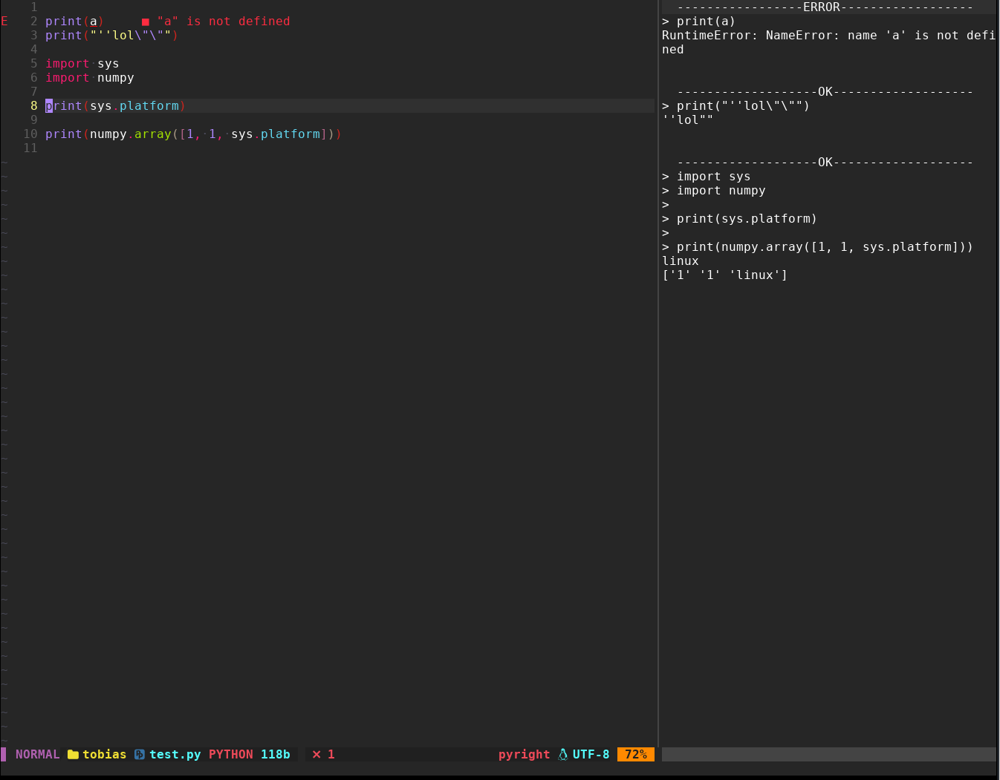

# Introduction

Sniprun has many different display modes, which you can combine and filter:

Display modes:

- "Classic"
- "VirtualText"
- "Terminal"
- "TerminalWithCode"
- "TempFloatingWindow"
- "LongTempFLoatingWindow"
- "NvimNotify"
- "Api"

Suffixes:

- "Ok" (only display sucessfull results)
- "Err" (only display errors - compilation or runtime)

To configure which display mode(s) you want, just include their names (+suffix if wanted) in the `display` configuration key:

```
lua << EOF

require('sniprun').setup({
    display = {
        "Classic",         -- will display both 'ok' & 'err' results in the command area
        "VirtualTextOk",   -- will display only 'ok' results as virtual text on the line sent to sniprun
    },
})

EOF
```

# Available display modes

(classic-display)=
## Classic

Results are displayed on the command area.

**Pro/cons:**

 - Supports multi-lines results
 - Can (maybe) be copied
 - Ok/Err highlighting
 - Disappear on the next keypress

```
lua << EOF
require'sniprun'.setup({
  display = { "Classic" },
})
EOF
```

    
 


(virtualtext-display)=
## Virtual Text

Results are displayed as virtual text after the end of the line you sent to sniprun. (In case it's a block, it goes at the end of the last line)

**Pro/cons:**

 - Does not disappear (except after a SnipClose)
 - Ok/Err highlighting (outputs for ok and error results are highlighted with the groups `SniprunVirtualTextOk` and `SniprunVirtualTextErr` respectively)
 - Visually close to the code
 - No multiline possible. Results are shortened on a best-effort basis
 - Cannot be copied

```
lua <<EOF
require'sniprun'.setup({
  display = {
    "VirtualText",
  },
})
EOF
```

 


(floatingwindow-display)=
## Temporary floating windows

Result are displayed in (temporary) floating windows. "LongTempFloatingWindow" will only display multiline messages, which allow for nice combinations with "VirtualText"

**Pro/cons:**

 - Visually close to the code
 - Ok/Err highlighting (the highlight groups used are "SniprunFloatingWinOk" and "SniprunFloatingWinErr")
 - Supports multiline results
 - Disappears on the next keypress
 - Cannot be copied

```
require'sniprun'.setup({
  display = { "TempFloatingWindow" },
})
```

 

(terminal-display)=
## Terminal

Results are displayed in a side panel

**Pro/cons:**

 - Support multiline, and auto-scrolls when full
 - Results can be copied and do not disappear (except after a SnipClose)
 - Customizable width
 - No highlighting (only a 'ok' or 'err' message)
 - Can display the code that ran along with the result (with the "TerminalWithCode" variant)

```
lua << EOF
require'sniprun'.setup({
    display = { "Terminal" },
    display_options = {
        terminal_width = 45,
    },
})
EOF
```


if you experience wrapping of the header line '---- OK ---' due to the presence of a number column, you can (and should anyway) set 

```vim
autocmd TermOpen * setlocal nonu
```

 




(notification-display)=
## Notification

Results are displayed through the [nvim-notify](https://github.com/rcarriga/nvim-notify) plugin (which must be installed).

**Pro/cons**:

 - Supports multiline
 - Ok/Err highlighting
 - Disappears after 5s (timeout is customisable)


 ```
lua << EOF
require'sniprun'.setup({
    display = {"NvimNotify"},
    display_options = {
        notification_timeout = 5   -- in seconds
    },
})
EOF
```

 

(api-display)=
## API display

Results are displayed through an user-provided function

You can register listeners that will be called upon (async) sniprun output:


```lua
local sa = require('sniprun.api')

sa.register_listener(custom_function)
```

where custom function is a function that take one unique argument: a table which contains at least two entries:

 - 'status' (a string that's either 'ok' or 'error' for now, but your function should accept & manage other values)
 - 'message' (also a string, maybe be multiline)

(Simply put, registered functions are callbacks)


Thus, an example of such a function (imitating the 'Classic' display with 'uwu' tendencies) would be

```lua
local api_listener = function (d)
    if d.status == 'ok' then
        print("Nice uwu: ", d.message)
    elseif d.status == 'error' then
        print("Oh nyow! Somethuwuing went wyong: ", d.message)
    else 
        print("Whut is this myeow? I don't knyow this status type nyah")
    end
end

sa.register_listener(api_listener)
```

(You must also enable the 'Api' display option, and in this particular case where things are printed to the command line area, disabling 'Classic' is recommended)


If your function requires to be manually closed (on `SnipClose`), you can register a closer the same way:

```lua
sa.register_closer(custom_function)
```

